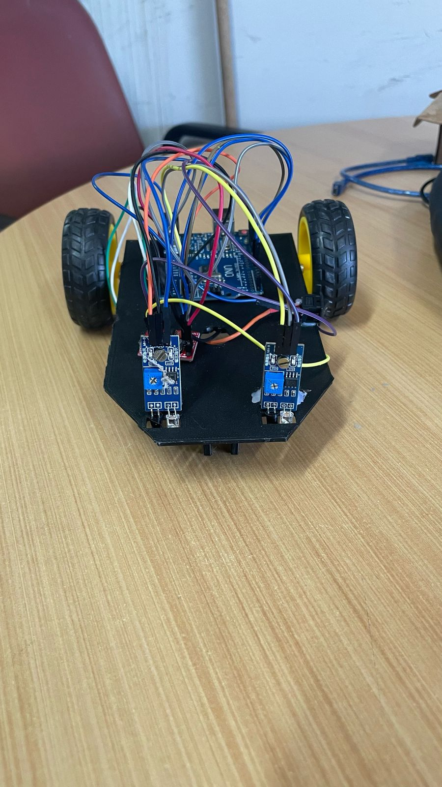
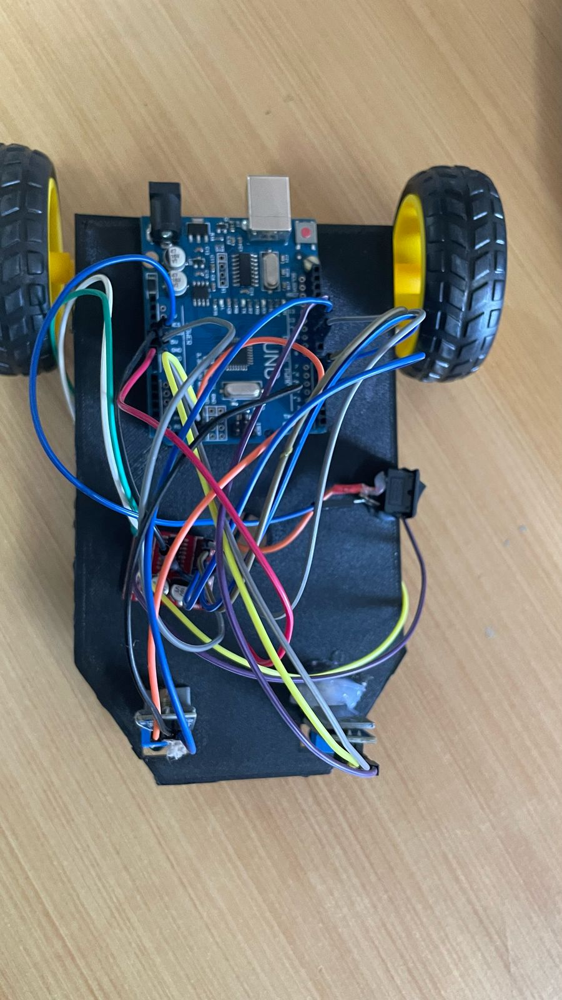
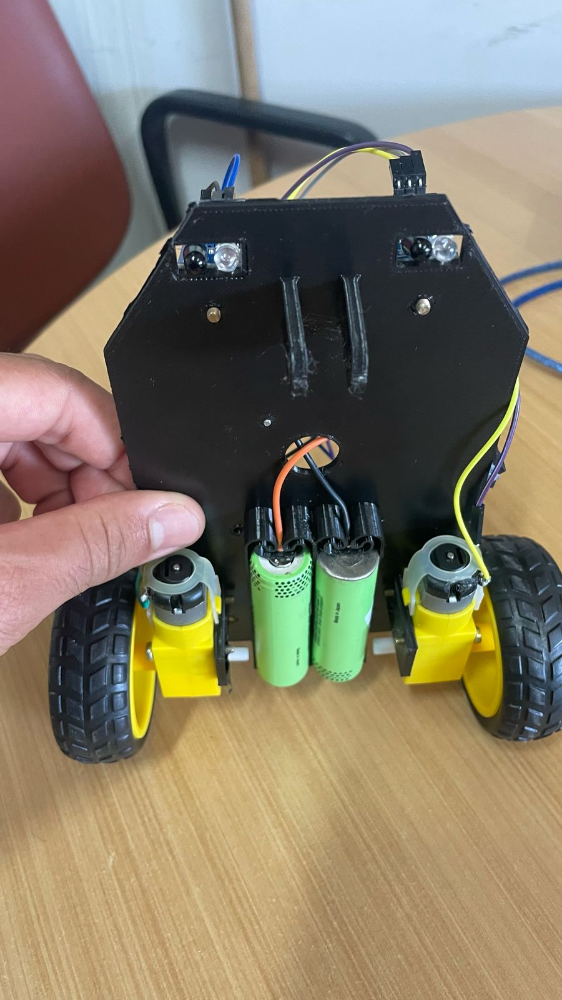

# UCE II - Software Para Robô Seguidor de Linha

### Membros:
- [Emily Júnia Costa Silva](https://github.com/Emillyjs)
- [Mateus Martins Peres](https://github.com/Theu2003)
- [Micael Pereira da Silva](https://github.com/Mikemps)
- [Nifane Borges Guimaraes](https://github.com/Nifane3)
- [Vinícius Alves Amorim](https://github.com/am0rimdev)
---
### Objetivo:
- Finalizar a implementação de um robô seguidor de linha, assegurando seu
funcionamento eficaz para identificar e seguir trajetórias.

### Justificativa:
- A necessidade identificada pelo projeto R.E.T.A. foi finalizar o desenvolvimento de
um robô seguidor de linha. Iremos terminar a implementação do código aplicando
todas as funcionalidades necessárias.

### Metodologia:
- Pesquisa e Planejamento: Estudar os conceitos de robótica móvel e algoritmos de
seguimento de linha.
- Desenvolvimento de Software: Analisar o software existente e dar continuidade a
ele implementando as funcionalidades necessárias.
- Testes e Ajustes: Realizar testes em diferentes cenários para validar o
funcionamento do robô e realizar ajustes necessários para aprimorar sua
performance.
- Documentação e Apresentação: Elaborar um relatório detalhando os
procedimentos, resultados e aprendizados adquiridos ao longo do projeto.

### Resultados esperados:
- Esperamos ter um robô funcional capaz de seguir trajetórias marcadas por uma linha no chão, utilizando sensores específicos para detecção e correção de percurso. O robô deverá operar de forma autônoma, respondendo de maneira eficiente a curvas, bifurcações e variações no trajeto, demonstrando precisão e estabilidade em seu funcionamento. Esperamos também que o projeto contribua para o nosso desenvolvimento de habilidades técnicas em robótica e programação.

### Cronograma:
1. Pesquisa e planejamento
2. Implementação dos sensores infravermelho
3. Implementação das condições de parada
4. Testes e ajustes

### Resultados obtidos:
- Obtivemos um robô funcional capaz de seguir trajetórias marcadas por uma linha no chão, utilizando sensores específicos para detecção e correção de percurso. O robô pode operar de forma autônoma após sua ativação, responde de maneira eficiente a curvas, bifurcações e variações no trajeto, além de demonstrar precisão e estabilidade em seu funcionamento.

### Relatório final:
- No início desse projeto foi um pouco complicado entendermos como era o funcionamento do robô seguidor de linha, como seus métodos seriam implementados e como iríamos controlá-lo, mas com algumas pesquisas encontramos alguns vídeos no youtube sobre como era a montagem desse tipo de robô bem como a implementação de suas funcionalidades. O código final do robô foi confeccionado por Vinicius que se dispôs a fazê-lo por sua experiência com a linguagem e tendo em vista que não era algo que demandava o auxílio do grupo como um todo graças às pesquisas que fizemos e compartilhamos. Houve uma certa dificuldade apenas na integração dos circuitos no robô, em relação a quais eram as portas lógicas que deveriam ser utilizadas, mas nada que não fosse rapidamente solucionado. O uso da linguagem C++ foi uma novidade para a maioria dos membros do grupo durante nossas pesquisas, participar desse projeto com a robótica foi uma experiência interessante e uma boa oportunidade de ver mais do que o campus tem a oferecer, já que nem todos tem tanto interesse pela área da robótica, uma disciplina que nos permite participar de projetos assim como parte de sua ementa é excelente para que os alunos participem de áreas diferentes da programação e quem sabe descubram uma nova zona de interesse.
---
## Imagens do projeto:

    
    
    

## Materiais utulizados:
- https://youtu.be/KY-BdZ-YDMI?si=iCWbLY3Bi42xQA-K
- https://youtu.be/OjdDcRlEti4?si=pCx865eKw1E1ZDsN

